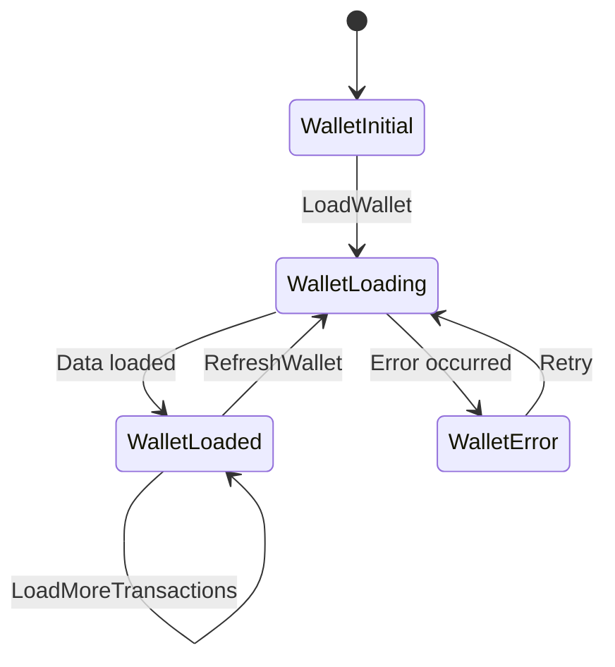

# Task 1 — Architecture Overview

## 1.1 Project Structure

I organized the project using a **feature-first structure**. The wallet feature has its own folder, and inside it the code is split into clear layers such as `data` and `presentation`. Shared code that can be reused by other features lives inside `core`.

```txt
lib/
├── core/
│   ├── error/                    # App exceptions and wallet error codes
│   ├── locale/                   # Language switching logic
│   ├── network/                  # Future HTTP client setup
│   ├── responsive/               # Responsive layout helpers
│   ├── router/                   # GoRouter configuration
│   ├── theme/                    # Colors and app theme
│   ├── utils/                    # Formatters and validators
│   └── widgets/                  # Shared reusable widgets
├── features/
│   └── wallet/
│       ├── data/
│       │   ├── models/           # Wallet models and JSON serialization
│       │   └── repositories/     # WalletRepository and mock implementation
│       └── presentation/
│           ├── bloc/             # WalletBloc, events, and states
│           ├── screens/          # Wallet screen
│           ├── transfer/         # Transfer screen and transfer state logic
│           └── widgets/          # Wallet-specific UI widgets
├── l10n/                         # Localization files
├── app.dart                      # App configuration
└── main.dart                     # Dependency injection entry point
```

I choose this structure because it keeps everything related to the wallet feature in one place. This makes the code easier to read, test, and maintain. If the application grows later, each new feature can follow the same pattern without mixing unrelated files together.

The UI layer does not depend directly on a concrete data source. Instead, it works with the `WalletRepository` abstraction. For this assessment, the app uses `MockWalletRepository`, but the same screens and BLoC can work with a real API implementation later with minimal changes.

---

## 1.2 State Management Choice

I used `flutter_bloc` for the wallet screen because the screen has multiple actions and states: loading wallet data, refreshing, filtering transactions, handling errors, and loading more items.

For the transfer screen, I used a simpler Cubit because the flow is more direct: the user fills the form, submits it, then the screen shows either loading, success, or failure. Using a full Bloc there would add extra complexity without much benefit.

This approach keeps the wallet logic predictable and easy to test. Each user action maps clearly to a state change, which is useful for both debugging and unit testing.

### Wallet State Flow



The main flow is:

```txt
User opens Wallet
↓
Wallet starts loading
↓
Balance and transactions are loaded
↓
Wallet screen displays the data
↓
User selects a transaction filter
↓
Filtered transactions are displayed
```

When filtering transactions, the original transaction list is preserved. This is important because the user should be able to switch between filters such as `All`, `Earn`, `Redeem`, and `Transfer` without losing the original data or needing to reload everything from the repository.

---

## 1.3 Error Handling Approach

Errors are handled in a structured way instead of throwing generic exceptions everywhere.

The data layer throws a custom `WalletException` for known wallet-related errors. Each exception has a clear error code, such as:

```txt
INSUFFICIENT_BALANCE
RECIPIENT_NOT_FOUND
NETWORK_ERROR
UNKNOWN_ERROR
```

The BLoC or Cubit catches these exceptions and converts them into UI states. This keeps the UI simple because it only reacts to states like `WalletError` or `TransferFailure`.

For the wallet screen, loading errors are shown as a full error view with a retry button. This allows the user to try loading the wallet again.

For the transfer screen, business errors such as insufficient balance or recipient not found are shown as clear user-facing messages. The user stays on the form so they can fix the issue without losing their input.

Form validation errors are handled before submitting the request. For example, the app validates that the recipient is a valid email or Egyptian phone number, the points amount is a whole number, and the note does not exceed the allowed length. This prevents invalid data from reaching the repository in the first place.

Unexpected errors are converted into a safe generic message, so raw technical details or stack traces are never shown to the user.