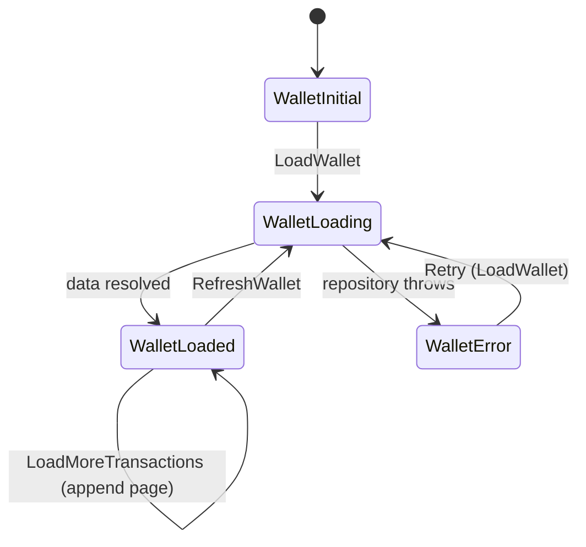

# Task 1 — Architecture Overview

## 1.1 Project Structure

The feature is organized **feature-first**, and each feature is split into
**layers** (`data` / `presentation`). Cross-cutting concerns live in `core`.

```
lib/
├── core/                         # Shared, feature-agnostic building blocks
│   ├── error/                    # WalletException + typed WalletErrorCode
│   ├── locale/                   # LocaleCubit (in-app en/ar switch)
│   ├── network/                  # (future) real HTTP client — see optional pkg
│   ├── responsive/               # Breakpoints + CenteredContent helpers
│   ├── router/                   # GoRouter configuration
│   ├── theme/                    # AppColors, AppTheme
│   ├── utils/                    # Formatters, Validators
│   └── widgets/                  # Small shared widgets (LanguageToggleButton)
├── features/
│   └── wallet/
│       ├── data/
│       │   ├── models/           # Immutable, JSON-serializable value objects
│       │   └── repositories/     # WalletRepository (abstract) + Mock impl
│       └── presentation/
│           ├── bloc/             # WalletBloc (events + states)
│           ├── screens/          # WalletScreen
│           ├── transfer/         # TransferCubit + TransferScreen
│           └── widgets/          # BalanceCard, TransactionTile, filters, ...
├── l10n/                         # ARB files + generated AppLocalizations
├── app.dart                      # MaterialApp.router + theming + l10n
└── main.dart                     # Dependency injection bootstrap
```

**Why feature-first (vs. layer-first)?** A `features/wallet/` folder keeps
everything about one capability in one place, so the code is easy to navigate,
own, and eventually extract into a module/package. Layer-first (`models/`,
`screens/`, `blocs/` at the root) scatters a single feature across the tree and
scales poorly as features multiply. Inside each feature we still separate
`data` from `presentation` so UI never touches networking directly.

**Dependency direction:** `presentation → data (abstraction)`. The BLoC depends
only on the `WalletRepository` *interface*, never on `MockWalletRepository`.
Swapping in a real API is a one-line change in `main.dart`.

## 1.2 State Management Choice — BLoC (`flutter_bloc`)

**Choice:** `flutter_bloc` — `WalletBloc` for the wallet screen and a
`TransferCubit` for the single-action transfer form.

**Justification:**
- The assessment explicitly requires `flutter_bloc`.
- BLoC gives an explicit, testable event→state contract that shines for a screen
  with several actions (load, refresh, filter, paginate) and clear states
  (initial/loading/loaded/error). Those states are trivial to unit-test with
  `bloc_test`.
- A **Cubit** is used for the transfer submission because it has a single
  imperative action (`submit`); a full event-driven Bloc would be ceremony
  without benefit. Both come from the same library, so the mental model is one.

### State flow



Mapped to the required scenario:

> User opens Wallet → **WalletLoading** (shimmer) → balance + first page load →
> **WalletLoaded** → user taps a filter chip → **WalletLoaded** with
> `activeFilter` set; `visibleTransactions` recomputes from the **preserved**
> master list, so switching back to "All" restores everything with no refetch.

## 1.3 Error Handling Approach

Errors are modeled as a **typed** `WalletException(code, message)` where `code`
maps to a `WalletErrorCode` enum (`insufficientBalance`, `recipientNotFound`,
`network`, `unknown`). This keeps error handling type-safe end-to-end.

- **Data layer** throws `WalletException` for known API errors.
- **BLoC/Cubit** catch it and emit an error state carrying the `code`
  (`WalletError` / `TransferFailure`). Unexpected errors are mapped to
  `WalletErrorCode.unknown` so nothing leaks a raw stack trace to the user.
- **UI layer** translates the `code` into a **localized** message
  (`WalletErrorView.messageFor`) and chooses the presentation:
  - full-screen load failure → `WalletErrorView` with a **Retry** button,
  - transfer failure (`INSUFFICIENT_BALANCE`, `RECIPIENT_NOT_FOUND`) →
    inline **SnackBar** so the user keeps their form input,
  - **validation errors** are handled before any request via `TextFormField`
    validators, so invalid input never reaches the repository.
